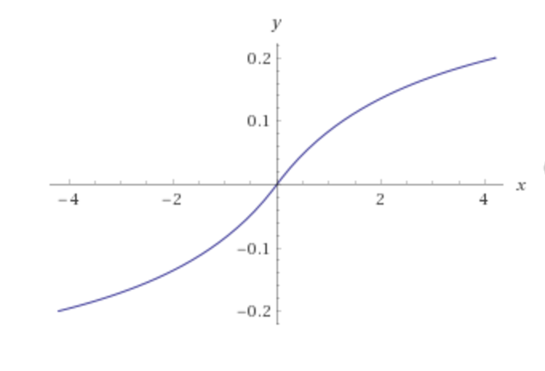
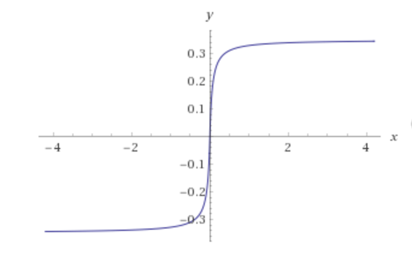

# Q - Nodular Bass Synthesizer/Sequencer

The Q Nodular Bass Synthesizer/Sequencer is a musical instrument controlled by interactions between nodes and particle streams.

## Nodes

- **Synth**
  - Two oscillators per node.
  - Sine, triangle, square, and sawtooth waveforms.
  - Noise generator.
  - Independent frequency and gain controls for each oscillator.
  - Attack and release controls.
  - Lag and probability controls.
  - Pan control.
  - FX chain send control.
- **MIDI**
  - noteOn/noteOff messages to the specified MIDI destination.
  - Lag and probability controls.
  - Velocity control.
  - Note and octave selectors.
  - MIDI destination selector.
- **Audio**
  - Audio sample file playback (wav, mp3, aiff, etc. )
  - Attack and release controls.
  - Lag and probability controls.
  - Pan control.
  - FX chain send control.

## Streams

- **Linear**
  - Linear particle flow (user-defined length).
  - Particle count and speed controls.
- **Circular**
  - Circular particle flow (user-defined radius).
  - Particle count and speed controls.
- **Freehand**
  - Freehand particle flow (user defined path).
  - Particle count and speed controls.

## FX Chain

- **Wave Shaper**

  - Nonlinear distortion.

    | Min value                                | Max value                                |
    | ---------------------------------------- | ---------------------------------------- |
    |  |  |

- **Delay**

  - Time and Feedback controls

- **Biquad Filter**

  - Simple low-order filter.
  - Cuttof frequency, Q and Attack controls.

- **Reverb**

  - Amount control
  - The following impulse responses are available:
    - [Hamilton Mausoleum](http://www.openairlib.net/auralizationdb/content/hamilton-mausoleum)
    - [Abernyte Grain Silo](http://www.openairlib.net/auralizationdb/content/abernyte-grain-silo)
    - [Falkland Palace Bottle Dungeon](http://www.openairlib.net/auralizationdb/content/falkland-palace-bottle-dungeon)
    - [R1 Nuclear Reactor Hall](http://www.openairlib.net/auralizationdb/content/r1-nuclear-reactor-hall)
    - [Tvísöngur Sound Sculpture, Iceland](http://www.openairlib.net/auralizationdb/content/tv%C3%ADs%C3%B6ngur-sound-sculpture-iceland-model)
    - [York Minster](http://www.openairlib.net/auralizationdb/content/york-minster)
    - [St. Mary's Abbey Reconstruction](http://www.openairlib.net/auralizationdb/content/st-marys-abbey-reconstruction)
    - [Terry's Typing Room](http://www.openairlib.net/auralizationdb/content/terrys-typing-room)
    - [Errol Brickworks, Errol, Perth and Kinross](http://www.openairlib.net/auralizationdb/content/errol-brickworks-errol-perth-and-kinross)
    - [Dromagorteen stone circle, Co. Kerry, Ireland](http://www.openairlib.net/auralizationdb/content/dromagorteen-stone-circle-co-kerry-ireland)

  ​