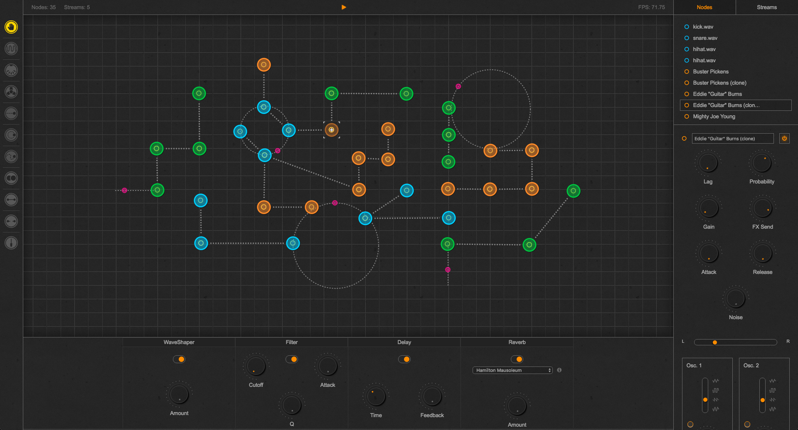
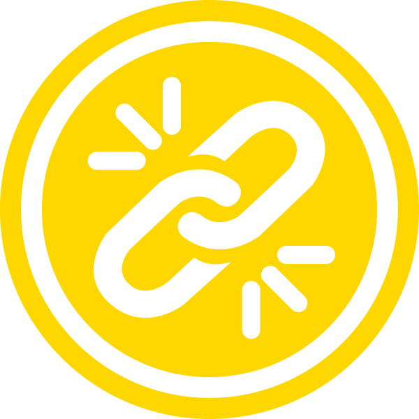

### 
Q - Nodular Sequencer

------

Q is a Nodular Sequencer controlled by the interactions between nodes and particle streams. It was built using <a href="https://facebook.github.io/react/" target="_blank">React</a>.

## Platforms

Q has been tested on Chrome but it should work on any decent browser with MIDI support.

## Nodes

Nodes generate midi messages whenever they become in contact with a particle.

- **MIDI**
  - noteOn/noteOff messages to the specified MIDI destination.
  - Lag and probability controls.
  - Velocity control.
  - Note and octave selectors.
  - MIDI destination selector.

## Streams

Particles travel along the paths defined by streams. Streams can have zero or more particles. There are three different types of particles:

- **Linear**
  - Linear particle flow (user-defined length).
  - Particle count and speed controls.
- **Circular**
  - Circular particle flow (user-defined radius).
  - Particle count and speed controls.
- **Freehand**
  - Freehand particle flow (user defined path).
  - Particle count and speed controls.

## User Guide

|                   Icon                   | Action                                   |
| :--------------------------------------: | :--------------------------------------- |
|  | **Grab nodes** - Click on a node to select it. Click and drag a node to change its position. Click on an empty area to deselect nodes. ⌘+Drag on an epmty area to shift the position of the display panel. |
|  | **MIDI nodes** - Click anywhere on the display panel to create a MIDI node. |
|  | **Linear Streams** - Click and drag anywhere on the display panel to create a linear stream. |
|  | **Circular Streams** - Click and drag anywhere on the display panel to create a circular stream. |
|  | **Freehand Streams** - Click and drag anywhere on the display panel to create a freehand stream. |
|  | **Clone nodes** - Click on a node to clone it. |
|  | **Link nodes** - Click on a node and drag to a second node to link them. Messages travel from parent nodes to child nodes but not from child nodes to parent nodes. Loops are not allowed. |
|  | **Unlink nodes** - Click on a parent node and drag to a child node to unlink them. |

## Keyboard Shortcuts

| Shortcut  | Action                                 |
| --------- | -------------------------------------- |
| Spacebar  | Play/Pause.                            |
| Backspace | Delete nodes.                          |
| ⌘+A       | Select all nodes.                      |
| ⌘+S       | Save project.                          |
| ⌘+O       | Open project.                          |
| ⌘+N       | Create a new project                   |
| ⌘+⇧+S     | Save current project to local storage. |
| ⌘+⇧+O     | Load project from local storage.       |
| ⌘+⇧+C     | Clear local storage.                   |
| ⌘+Click   | Select Multiple nodes.                 |
